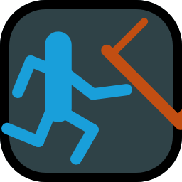
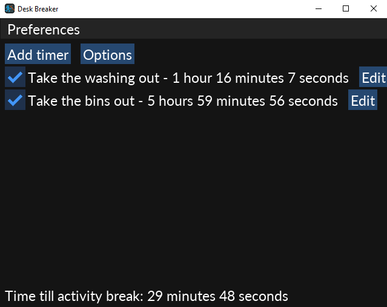

#  Desk Breaker


⚠️ **WARNING:** This application is still in early alpha stages and used personally only. I don't recommend you use this.

This app detects when you are using your computer and will pop-up with a window that covers your screen, forcing you to take a short 5 minute break.

This was built for those who have trouble with hyperfocusing and need something to aggressively tell them when it's time to step away from the computer.



## Requirements

* [Zig 0.15.2](https://ziglang.org/download/#release-0.15.2)

## How to download

Check the [releases page here](https://github.com/silbinarywolf/desk-breaker/releases/).

## How to build from source

1. Download Zig version mentioned above.

2. Open a terminal on folder containing `build.zig` (the root folder)

3. Run the following

```sh
zig build run
```

## Unquarantining the application for Mac users

To easily allow this application to run on your Mac device, you can run the following from your commandline from the folder that contains the application.

```
xattr -d com.apple.quarantine ./desk-breaker-mac
```

## Dependencies

- [Zig](https://github.com/ziglang/zig) - MIT License
- [SDL](https://github.com/libsdl-org/SDL) - Zlib License
- [Freetype](https://github.com/freetype/freetype) - FreeType License or GPLv2
- [ImGui](https://github.com/ocornut/imgui) - MIT License
- [cimgui](https://github.com/cimgui/cimgui) - C Bindings for ImGui - MIT License
- [Lato-Regular.ttf](https://www.fontsquirrel.com/license/lato) - SIL Open Font License
